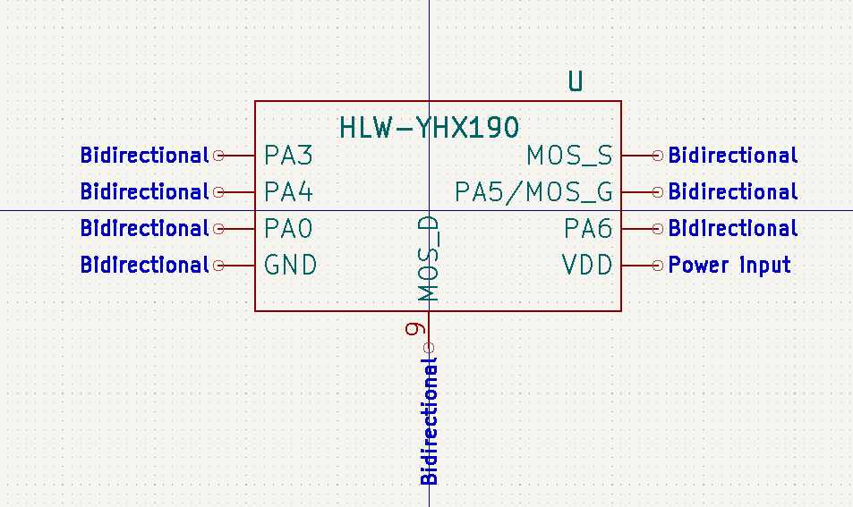


## Table of Contents

- [Overview](#overview)
- [Pin Descriptions](#pin-descriptions)
- [Contributing](#contributing)
- [License](#license)

# Overview

This repository contains the schematic symbols for HLW-YHX190, an OTP-Based 8-Bit microcontroller series.

_Footprints and 3D models are not yet available, contributations are welcome._

Please note that while every effort has been made to ensure accuracy, the symbols provided in this library may contain errors or inaccuracies. The contributors and maintainers of this library cannot guarantee the correctness or completeness of the information provided. Therefore, users are advised to independently verify the symbols and designs before use.

# Contributing

Contributions to improve the accuracy and completeness of the symbols are welcome and encouraged. If you discover any errors or have suggestions for improvements, please consider contributing by submitting a pull request. By contributing to this repository, you agree to license your contributions under the same terms as the original project.

# Pin Descriptions

| Pin        | Number  | Type | Description                                         |
|------------|---------|------|-----------------------------------------------------|
| PA3, CIN-, TM2PWM | 1 | IO, CMOS, Analog | This pin can be used as: Port A bit 3, which can e programmed as an input or output with a weak pull-up resistor mode. Negative input source of the comparator. Output of the 8-bit Timer2 counter. When used as an analog input, to reduce leakage current, disable its digital input function using register bit 3 of padier. This pin can be set to wake up the system during sleep mode; however, when register bit 3 of padier is '0', the wake-up function is disabled.|
| PA4, CIN+. CIN-, TM2PWM | 2 | IO, CMOS, Analog | This pin can be used as: Port A bit 4, which can be programmed as an input or output with a weak pull-up resistor mode. Positive input source of the comparator. Negative input source of the comparator. Output of the 8-bit Timer2 counter. When used as an analog input, to reduce leakage current, disable its digital input function using register bit 4 of padier. This pin can be set to wake up the system during sleep mode; however, when register bit 4 of padier is '0', the wake-up function is disabled. |
| PA0, INT0, CO | 3| IO, CMOS | This pin can be used as: Port A bit 0, which can be programmed as an input or output with a weak pull-up resistor mode.External interrupt pin 0, which can trigger an interrupt on both rising and falling edges. Output of the comparator. This pin can be set to wake up the system during sleep mode; however, when register bit 0 of padier is '0', the wake-up function is disabled. |
| GND | 4 | | Ground |
| VDD | 5 | | Power |
| PA6, CIN- | 6 | IO, CMOS, Analog | Port A bit 6, can be set as an input or output with a weak pull-up resistor mode. Negative input source of the comparator. When used as an analog input, to reduce leakage current, disable its digital input function using register bit 6 of padier. This pin can be set to wake up the system during sleep mode; however, when register bit 6 of padier is '0', the wake-up function is disabled. |
| PA5 / MOS_G | 7 | IO, CMOS | This pin can be used as: An external reset for the microcontroller. Port A bit 5, which can be set as an input or open-drain output with a weak pull-up resistor mode. Connects to the G terminal of the internal PMOS transistor. This pin can be configured to wake up the system from sleep mode; however, when register bit 5 of padier is '0', the wake-up function is disabled. Additionally, when this pin is set as an input, for systems requiring high noise immunity, connect a 33Ω resistor in series. |
| MOS_S | 8 | CMOS | Connects to the S terminal of the internal PMOS transistor. |
| MOS_D | 9 | CMOS | Connects to the D terminal of the internal PMOS transistor. |

# License

Licensed under GNU GPL 2.0. See [License](LICENSE.md).